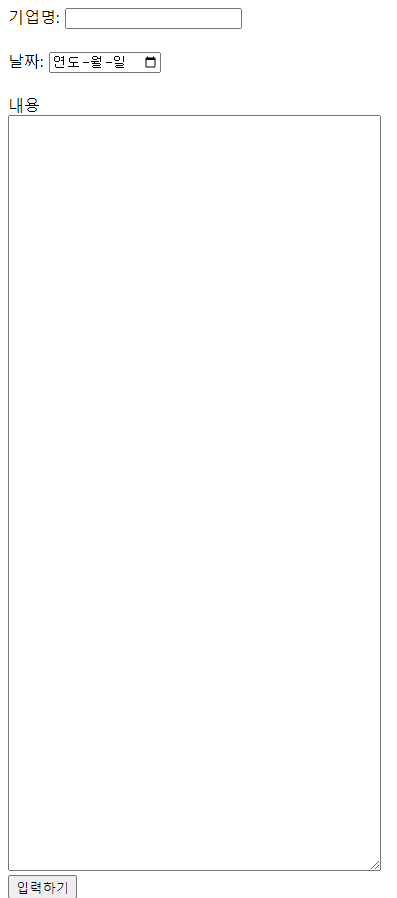

# LLM 연습 Project
구현 목표: 챗봇을 활용한 기사분석 및 주가예측  
실제로 사용할 수 있는 웹페이지를 만드는 것이 아니라 LLM 기능을 사용해 보는 것에 목적을 둠.

## app
### 기사입력
사용자가 기사의 중심이 되는 기업, 날짜, 내용을 입력하면 그 기사의 내용이 서버에 저장됩니다.  

### 주가예측
사용자가 주식의 종목코드를 입력하면 gpt를 통해서 오늘의 예상 종가를 표시해줍니다.  
사용자들이 입력한 기사를 기반으로 분석합니다.

## Troubleshooting
https://youtharchive.tistory.com/194  
https://youtharchive.tistory.com/195

## Version
Django==4.2  
openai==1.43.1  
opentelemetry-api==1.27.0  
langchain==0.2.16  